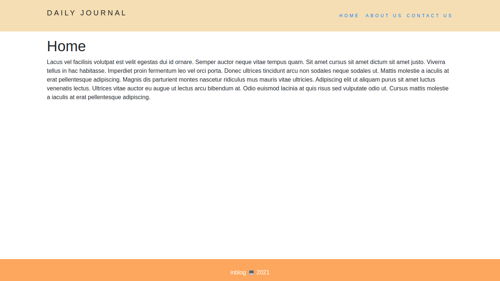
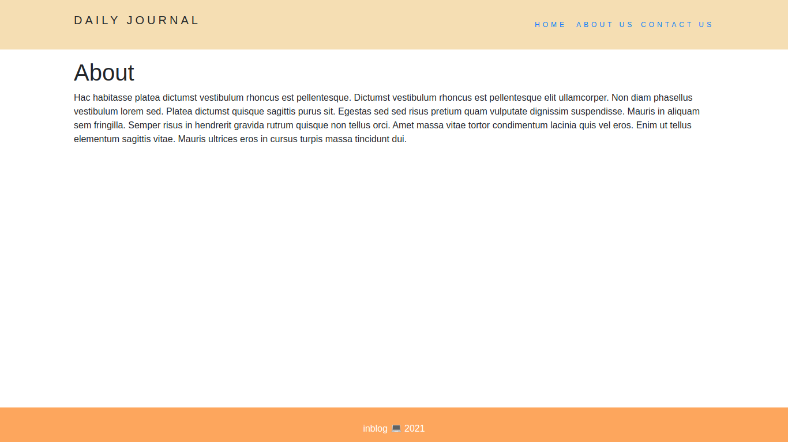
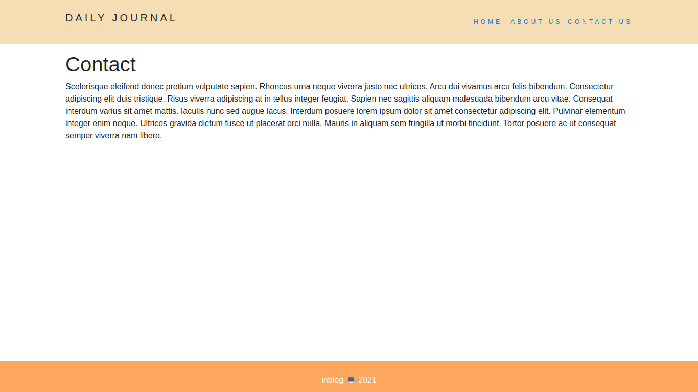
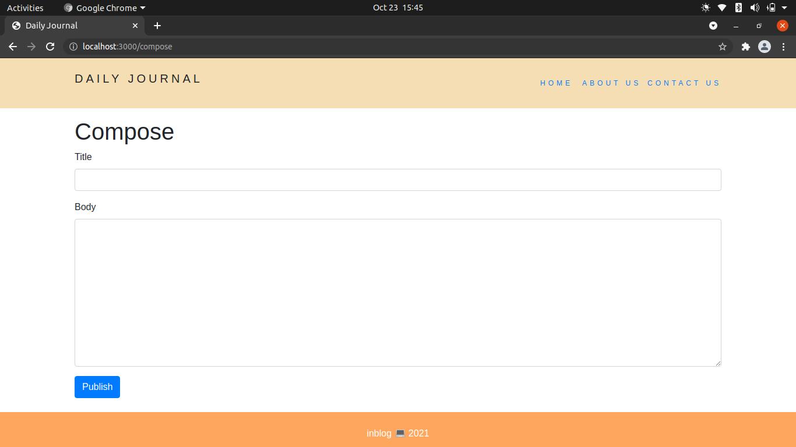
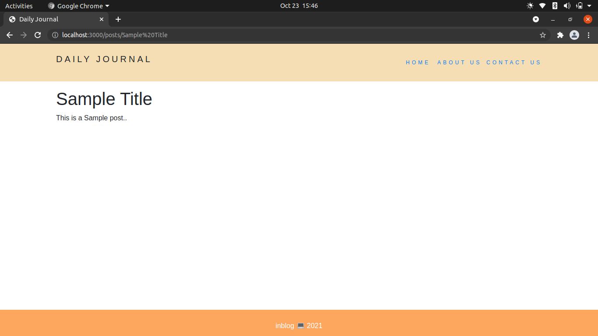

# Blog Website

A sample blog website to post articles.
~~Currently there isn't any database support to store the articles.~~
**Edited** :- MongoDB is used as For Crud operations

## Technologies Used:

- Node.js
- Express library
- EJS (template engine)
- lodash library (functional programming paradigm)

## Preview of Website

**Home Page**  

**About**

**Contact**

**Compose**

**Post**

### Feel free to fix any issues
> I am a rookie to the world of development. Any suggestions for improvement is appreciated...

> Discord id : Pretty_Noob#7261

